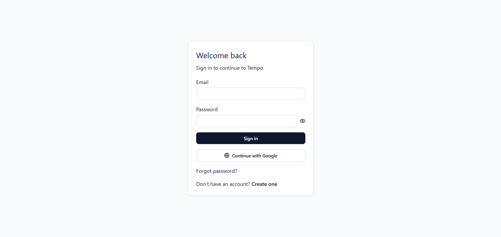
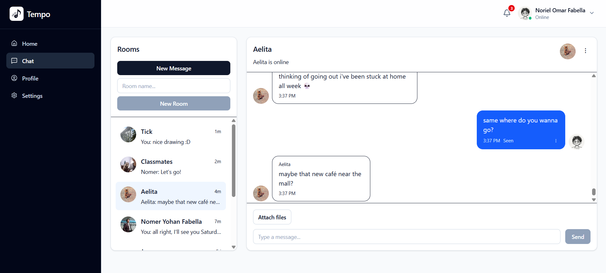
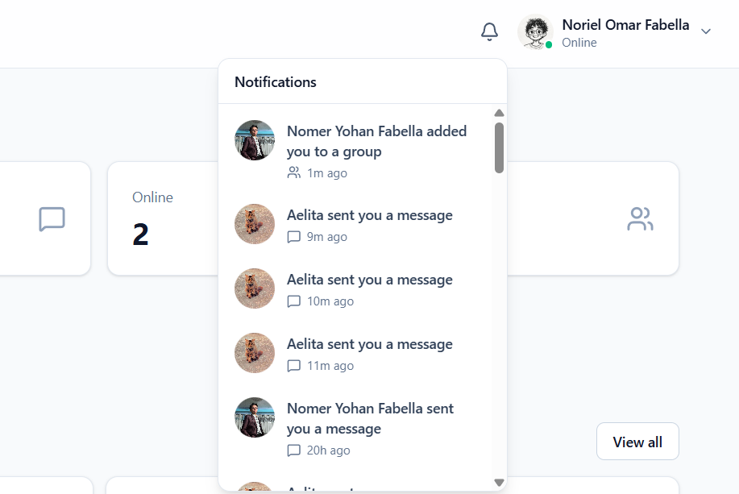
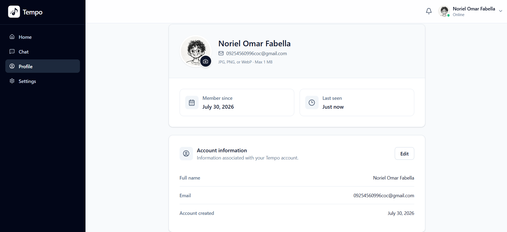
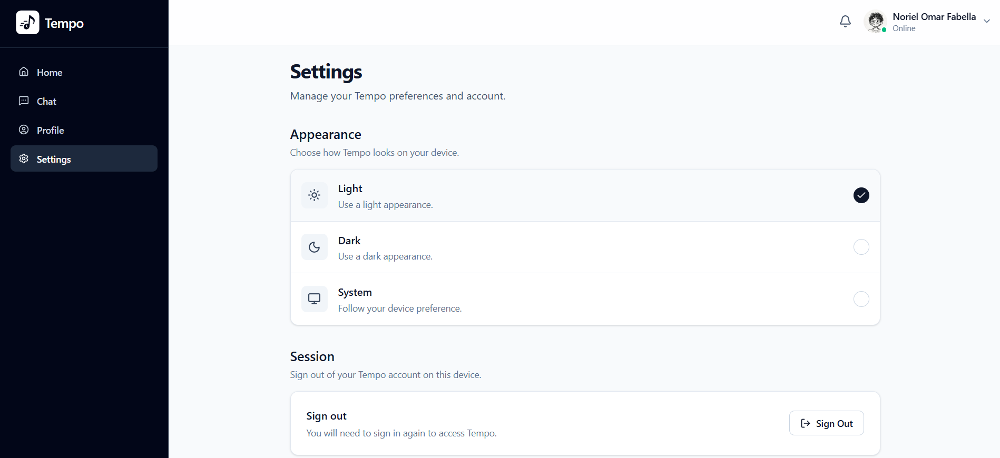
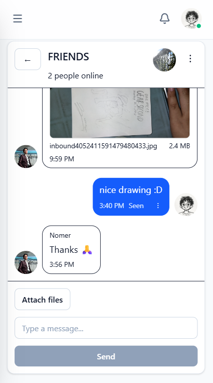

# Tempo

> A modern real-time chat and collaboration web application built with React, TypeScript, and Supabase.

[](https://tempo-zeta-self.vercel.app/)


🔗 **Live Demo:** https://tempo-zeta-self.vercel.app/

---

## 📖 About

**Tempo** is a real-time chat and collaboration web application designed for communication between users through direct messages and group conversations.

The application supports real-time messaging, presence indicators, typing indicators, unread messages, notifications, file attachments, profile management, and group room management.

Tempo is built as a frontend-first single-page application. Instead of using a custom Express or Node.js backend, the React application communicates directly with Supabase for authentication, database access, realtime functionality, and file storage.

---

## ✨ Features

### 💬 Messaging

- Direct messaging
- Group chat rooms
- Real-time message updates
- Edit your own messages
- Delete messages
- Message read status
- Unread message counts
- Latest message previews
- Room ordering based on recent activity

### ⚡ Real-Time Functionality

- Real-time messaging
- Online/offline presence
- Last-seen tracking
- Typing indicators
- Room updates
- Room-list synchronization
- Attachment updates

### 📎 Attachments

- Upload multiple attachments
- Image attachments
- PDF attachments
- Text files
- Office documents
- Attachment validation
- Maximum of **5 attachments per message**
- Maximum of **10 MB per upload**
- Signed URLs for controlled attachment access

### 🔔 Notifications

- New message notifications
- Group membership notifications
- Database-triggered notification creation
- Notification navigation to the relevant chat
- Mark individual notifications as read
- Mark notifications as read when opening the notification center

### 👤 Profiles

- View user profiles
- Update full name
- Upload and update avatars
- Search for other users
- Start direct messages from user search
- Add users to group rooms

### 👥 Room Management

- Create group rooms
- Add members
- Edit room information
- Upload room avatars
- Delete group rooms
- Hide direct-message conversations

### 🔐 Authentication

- Email/password registration
- Email/password sign-in
- Google OAuth
- Password reset
- Sign out
- Session restoration
- Protected application routes
- Public-route redirects for authenticated users

### 🎨 User Experience

- Responsive design
- Mobile-friendly layouts
- Light theme
- Dark theme
- System theme support
- Loading states
- Empty states
- Error messages
- Retry actions for failed queries

---

# 📸 Screenshots


## Authentication



## Chat Interface



## Notifications



## Profile



## Settings



## Mobile



---

# 🛠 Tech Stack

| Technology | Purpose |
|---|---|
| **React 19** | Frontend UI |
| **TypeScript** | Static typing |
| **Vite** | Development server and build system |
| **React Router** | Client-side routing and route protection |
| **Tailwind CSS** | Styling and responsive UI |
| **TanStack Query** | Server-state management and caching |
| **Supabase** | Backend platform |
| **Supabase Auth** | Authentication and session management |
| **PostgreSQL** | Relational database |
| **Supabase Realtime** | Real-time updates and presence |
| **Supabase Storage** | Avatars and file attachments |
| **Zod** | Runtime and form validation |
| **React Hook Form** | Form handling |
| **Lucide React** | Icons |
| **ESLint** | Linting |
| **Prettier** | Code formatting |
| **Vercel** | Deployment |

---

# 🏗 Architecture

Tempo follows a frontend-first architecture.

```text
React Frontend
    |
    +-- React Router
    +-- React State
    +-- TanStack Query
    |
    +--------------------+
                         |
                      Supabase
                         |
        +----------------+----------------+
        |                |                |
      Auth           PostgreSQL        Realtime
        |                |                |
     Sessions     Application Data    Live Updates
                         |
                      Storage
                         |
              Avatars / Attachments
```

The React frontend communicates directly with Supabase for:

- Authentication
- Database queries
- RPC functions
- Realtime subscriptions
- File storage

There is **no custom Node.js or Express backend** in this project.

---

# 🔄 Application Flow

A typical application flow follows this structure:

```text
User Action
    ↓
React Component
    ↓
Hook / Local State
    ↓
Service Function
    ↓
Supabase
    ↓
PostgreSQL / Auth / Realtime / Storage
    ↓
TanStack Query Cache
    ↓
UI Update
```

### Example: Sending a Message

```text
MessageComposer
    ↓
messages.service.ts
    ↓
Supabase/PostgreSQL
    ↓
Database Notification Trigger
    ↓
Realtime Update
    ↓
Query Invalidation / Refresh
    ↓
Updated UI
```

---

# 🔐 Authentication

Tempo uses **Supabase Auth**.

Supported authentication methods include:

- Email and password
- Google OAuth
- Password reset
- Session restoration

Authentication state is managed by `AuthProvider`.

On application startup, it:

1. Calls `supabase.auth.getSession()`
2. Listens for authentication state changes
3. Provides the current user and session
4. Determines whether the user is authenticated

### Route Protection

- `ProtectedRoute` prevents unauthenticated users from accessing `/app`
- `PublicRoute` redirects authenticated users away from authentication pages

---

# 🛡 Security

Tempo uses PostgreSQL **Row Level Security (RLS)** as an important authorization layer.

Room membership is central to controlling access to chat data.

A database helper function is used for membership checks:

```text
public.is_room_member(room_uuid)
```

RLS is used for important application data including:

- Rooms
- Room members
- Messages
- Notifications
- User chat activity

Frontend permission checks primarily improve the user experience.

Database policies and RLS provide the important authorization boundary.

---

# 🗄 Database Model

The main application entities are:

```text
profiles
   |
   +---- room_members ---- rooms
                            |
                            +---- messages
                                   |
                                   +---- message_attachments

notifications
typing_status
user_chat_activity
```

### Main Tables

#### `profiles`

Stores user profile information.

Examples:

- Full name
- Email
- Avatar
- Last seen timestamp

#### `rooms`

Represents chat rooms.

Supports:

- Direct messages
- Group conversations
- Room avatars

#### `room_members`

Connects users to rooms.

Also supports direct-message hiding through `deleted_at`.

#### `messages`

Stores chat messages.

Includes:

- Room
- Sender
- Content
- Created timestamp
- Updated timestamp
- Read status

#### `message_attachments`

Stores attachment metadata.

The actual files are stored in Supabase Storage.

#### `notifications`

Stores user notifications.

Notification types include:

- `new_message`
- `added_to_group`

#### `typing_status`

Tracks whether a user is currently typing in a room.

#### `user_chat_activity`

Tracks whether a user is actively using the chat interface.

---

# ⚡ Real-Time Functionality

Tempo uses **Supabase Realtime** for live updates.

Realtime functionality includes:

- New messages
- Room updates
- Room-list changes
- Typing indicators
- Online presence
- Attachment changes

### Presence

Tempo tracks active users using a global Realtime presence channel.

The application also maintains `last_seen_at` information for user activity.

### Typing Indicators

Typing state is stored using:

```text
room_id + user_id
```

as the logical unique combination.

The application uses upsert behavior to update typing status.

### Chat Activity

Tempo tracks whether users are actively using the chat interface through:

```text
user_chat_activity.is_chat_active
```

This allows the application to distinguish users who are generally online from users actively using the chat.

---

# 🔔 Notifications

Notifications are created through database triggers.

Important notification events include:

1. New messages
2. Users being added to group rooms

Example flow:

```text
Message Inserted
    ↓
Database Trigger
    ↓
Notification Created
    ↓
NotificationCenter
    ↓
User Opens Relevant Chat
```

Unique indexes are used to help prevent duplicate notifications.

---

# 📎 Attachments

Tempo supports file attachments in messages.

Supported file categories include:

- Images
- PDFs
- Text files
- Office documents

Attachments are validated before upload.

Limits include:

- **Maximum 5 attachments per message**
- **Maximum 10 MB per upload**

Files are stored in Supabase Storage.

Storage buckets include:

```text
avatars
room-avatars
message-attachments
```

Attachment metadata is stored in the `message_attachments` table.

Attachment access uses signed URLs with a limited lifetime.

---

# 📁 Project Structure

Tempo uses a feature-oriented frontend structure.

```text
src/
│
├── app/
│   ├── layouts/
│   ├── providers/
│   └── router/
│
├── features/
│   ├── auth/
│   ├── messaging/
│   ├── notifications/
│   ├── profile/
│   ├── users/
│   ├── workspaces/
│   ├── settings/
│   └── dashboard/
│
└── shared/
    ├── components/
    ├── supabase/
    ├── validation/
    └── utilities/
```

### Feature Responsibilities

| Feature | Responsibility |
|---|---|
| `auth` | Authentication, OAuth, guards, session state |
| `messaging` | Rooms, messages, typing, presence, attachments |
| `notifications` | Notifications and unread notification state |
| `profile` | Profiles, avatars, user search |
| `users` | User-related screens |
| `workspaces` | Workspace/home overview |
| `settings` | User preferences and settings |
| `dashboard` | Dashboard cards and quick actions |

---

# 🔌 Important Database Functions

Tempo uses Supabase RPC functions for important database operations.

Examples include:

```text
is_room_member
create_room
get_or_create_direct_room
hide_direct_room
search_profiles
```

These functions support controlled database operations such as room creation, membership checks, direct-message handling, and profile searching.

---

# 🚀 Getting Started

## Prerequisites

Make sure you have:

- Node.js installed
- npm installed
- A Supabase project

## Installation

Clone the repository:

```bash
git clone https://github.com/YOUR_USERNAME/tempo.git
```

Navigate into the project:

```bash
cd tempo
```

Install dependencies:

```bash
npm install
```

Create your environment file:

```bash
cp .env.example .env
```

Add your Supabase configuration:

```env
VITE_APP_NAME=Tempo
VITE_SUPABASE_URL=your_supabase_project_url
VITE_SUPABASE_ANON_KEY=your_supabase_anon_key
```

> Do not commit your `.env` file or expose private configuration values.

Start the development server:

```bash
npm run dev
```

---

# 🏗 Production Build

To create a production build:

```bash
npm run build
```

The production build performs TypeScript compilation followed by the Vite build process.

---

# 🌐 Deployment

Tempo includes a `vercel.json` configuration for static single-page application deployment.

The project is intended to be deployed on Vercel.

🔗 **Live Demo:** https://tempo-zeta-self.vercel.app/

---

# ⚠️ Current Limitations

Tempo currently has some areas for future improvement:

- No automated unit tests
- No integration test suite
- No E2E testing framework
- No centralized global error boundary
- No explicit role-based authorization system
- No visible CI/CD pipeline configuration
- No explicit email-verification workflow identified in the repository
- Message-delete RLS behavior should be verified against the deployed database

These are areas for future improvement rather than failures of the core application.

---

# 💡 Project Highlights

Tempo demonstrates:

- Real-time application development
- Supabase integration
- PostgreSQL database design
- Row Level Security
- Authentication and route protection
- Realtime subscriptions
- Presence tracking
- Typing indicators
- File storage and signed URLs
- Feature-oriented React architecture
- Server-state management with TanStack Query
- Responsive UI development
- Database-triggered notifications

One of the project's strongest aspects is the combination of:

> **React + Supabase Auth + PostgreSQL + Realtime + Storage + RLS**

---

# 👨‍💻 Author

**Noriel Omar R. Fabella**

Frontend Developer

- 🌐 Portfolio: https://noriel-portfolio-three.vercel.app
- 💻 GitHub: https://github.com/NorielFabella
- 💼 LinkedIn: https://linkedin.com/in/noriel-omar-fabella

---

# 📄 License

This project is licensed under the **MIT License**.


---

## 🔗 Live Demo

[**Visit Tempo →**](https://tempo-zeta-self.vercel.app/)
